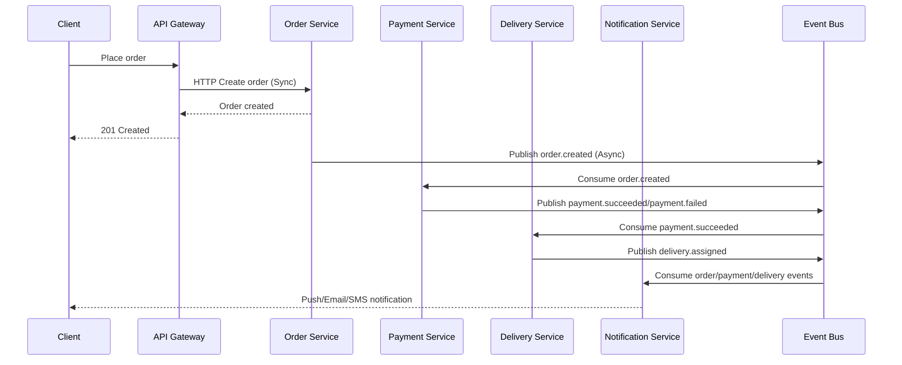

# Communication Diagram (Sync vs Async)

## Su dung Sync
- Dang nhap, lay menu, tao don hang, xac nhan thanh toan ngay.

## Su dung Async
- Cac buoc hau xu ly: thanh toan, dieu phoi giao hang, gui thong bao.
- Giam phu thuoc truc tiep giua service va tang kha nang mo rong.
