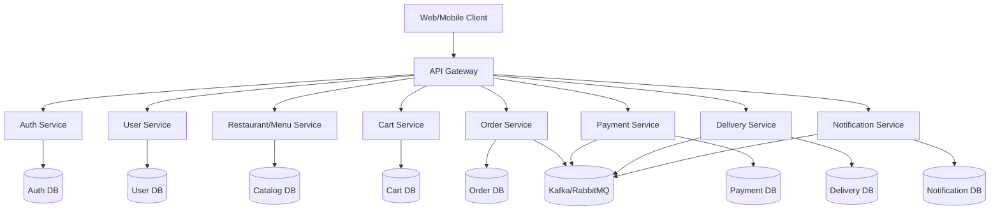

# Service Map - Online Food Delivery (Microservices)

```mermaid
graph TD
  Client[Web/Mobile Client] --> APIGW[API Gateway]

  APIGW --> Auth[Auth Service]
  APIGW --> User[User Service]
  APIGW --> Restaurant[Restaurant/Menu Service]
  APIGW --> Cart[Cart Service]
  APIGW --> Order[Order Service]
  APIGW --> Payment[Payment Service]
  APIGW --> Delivery[Delivery Service]
  APIGW --> Notification[Notification Service]

  Auth --> AuthDB[(Auth DB)]
  User --> UserDB[(User DB)]
  Restaurant --> CatalogDB[(Catalog DB)]
  Cart --> CartDB[(Cart DB)]
  Order --> OrderDB[(Order DB)]
  Payment --> PaymentDB[(Payment DB)]
  Delivery --> DeliveryDB[(Delivery DB)]
  Notification --> NotiDB[(Notification DB)]

  Order --> EventBus[(Kafka/RabbitMQ)]
  Payment --> EventBus
  Delivery --> EventBus
  Notification --> EventBus
```

## Ghi chu
- Moi service so huu database rieng.
- API Gateway la diem vao duy nhat cho frontend.
- Event Bus xu ly giao tiep bat dong bo.
