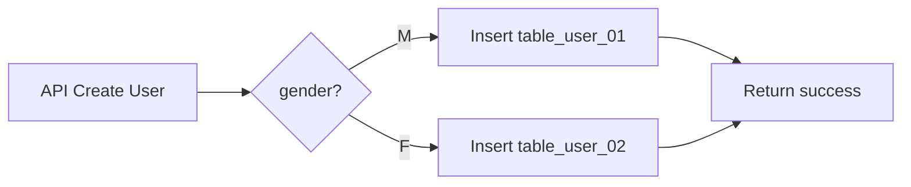
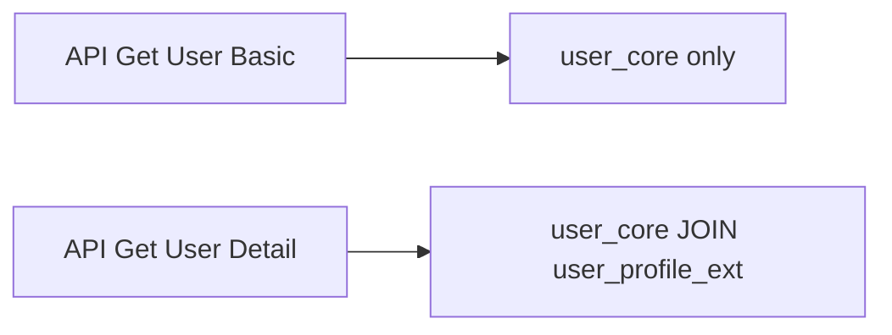
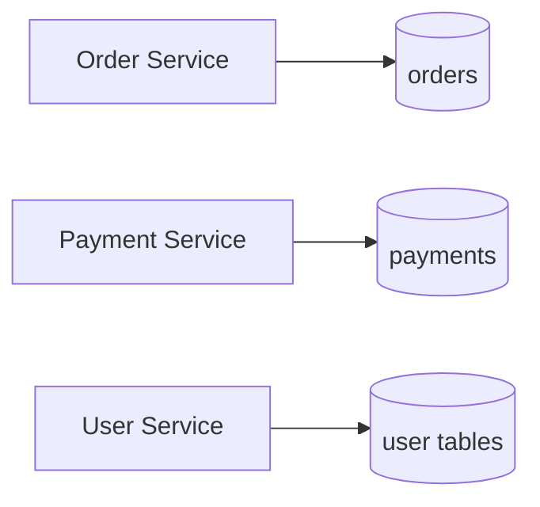

# Bai 02 - Database Partition (SQL Server)

Thoi luong goi y: 20 phut.
Muc tieu: hieu va minh hoa 3 kieu partition de tang performance.

## 1) Tong quan 3 kieu partition

## Horizontal Partitioning

- Chia theo dong (row).
- Cac bang co cung cau truc, du lieu duoc phan bo theo dieu kien.
- Vi du: nam vao `table_user_01`, nu vao `table_user_02`.

Loi ich:
- Giam kich thuoc moi bang con.
- Query co dieu kien phan vung se nhanh hon.

Trade-off:
- Query tong hop toan bo user can union.
- Logic ung dung phuc tap hon.

## Vertical Partitioning

- Chia theo cot (column).
- Tach nhom cot truy cap nhieu va nhom cot lon/it dung.

Loi ich:
- Giam I/O cho query thong thuong.
- Tang toc do do bo cot can doc it hon.

Trade-off:
- Can join lai khi can full thong tin.

## Functional Partitioning (logic/business)

- Chia theo chuc nang nghiep vu (user, order, payment...).
- Moi module co schema/bang rieng.

Loi ich:
- De scale tung module.
- Giam xung dot tai nguyen giua cac nghiep vu khac nhau.

Trade-off:
- Can chuan hoa giao tiep giua cac module.
- Truy van cross-function phuc tap hon.

---

## 2) Vi du cu the theo de bai

## 2.1 Horizontal: user nam/nu

### SQL Server schema

```sql
CREATE TABLE table_user_01 (
  user_id INT IDENTITY PRIMARY KEY,
  full_name NVARCHAR(100) NOT NULL,
  gender CHAR(1) NOT NULL CHECK (gender = 'M'),
  email NVARCHAR(150) UNIQUE
);

CREATE TABLE table_user_02 (
  user_id INT IDENTITY PRIMARY KEY,
  full_name NVARCHAR(100) NOT NULL,
  gender CHAR(1) NOT NULL CHECK (gender = 'F'),
  email NVARCHAR(150) UNIQUE
);
```

### Routing logic (Node.js)

```js
// pseudo code
async function createUser(db, payload) {
  const targetTable = payload.gender === 'M' ? 'table_user_01' : 'table_user_02';
  const sql = `INSERT INTO ${targetTable} (full_name, gender, email) VALUES (@name, @gender, @email)`;
  return db.query(sql, payload);
}
```

### Query tong hop

```sql
SELECT user_id, full_name, gender, email FROM table_user_01
UNION ALL
SELECT user_id, full_name, gender, email FROM table_user_02;
```

## 2.2 Vertical: tach profile lon

### SQL Server schema

```sql
CREATE TABLE user_core (
  user_id INT IDENTITY PRIMARY KEY,
  full_name NVARCHAR(100) NOT NULL,
  phone VARCHAR(20) NOT NULL,
  created_at DATETIME2 NOT NULL DEFAULT SYSDATETIME()
);

CREATE TABLE user_profile_ext (
  user_id INT PRIMARY KEY,
  avatar_url NVARCHAR(300) NULL,
  bio NVARCHAR(MAX) NULL,
  address NVARCHAR(300) NULL,
  FOREIGN KEY (user_id) REFERENCES user_core(user_id)
);
```

### Query nhanh (chi can core)

```sql
SELECT user_id, full_name, phone
FROM user_core
WHERE user_id = @userId;
```

### Query day du (join khi can)

```sql
SELECT c.user_id, c.full_name, c.phone, e.avatar_url, e.bio, e.address
FROM user_core c
LEFT JOIN user_profile_ext e ON c.user_id = e.user_id
WHERE c.user_id = @userId;
```

## 2.3 Functional: tach theo domain

### SQL Server schema theo function

- User domain: `user_core`, `user_profile_ext`
- Order domain: `orders`, `order_items`
- Payment domain: `payments`, `refunds`

Vi du:

```sql
CREATE TABLE orders (
  order_id BIGINT IDENTITY PRIMARY KEY,
  user_id INT NOT NULL,
  status VARCHAR(30) NOT NULL,
  total_amount DECIMAL(12,2) NOT NULL,
  created_at DATETIME2 NOT NULL DEFAULT SYSDATETIME()
);

CREATE TABLE payments (
  payment_id BIGINT IDENTITY PRIMARY KEY,
  order_id BIGINT NOT NULL,
  method VARCHAR(30) NOT NULL,
  status VARCHAR(30) NOT NULL,
  paid_at DATETIME2 NULL
);
```

---

## 3) Minh hoa workflow logic trong ung dung







---

## 4) Ap dung voi Spring Boot (y de bai)

Neu backend la Spring Boot, y tuong van nhu nhau:

- Horizontal:
  - Service layer route theo `gender` de chon repository/table.
- Vertical:
  - Tach entity `UserCore` va `UserProfileExt`.
  - Dung fetch lazy hoac query projection cho endpoint basic.
- Functional:
  - Tach package/module theo `user`, `order`, `payment`.

Pseudo service:

```java
if ("M".equals(user.getGender())) {
    user01Repository.save(user01);
} else {
    user02Repository.save(user02);
}
```

---

## 5) Performance notes

## Horizontal

- Tot khi query thuong co filter theo key partition.
- Nho hon tren moi bang => index nho hon, seek nhanh hon.

## Vertical

- Tot khi cot mo rong lon (bio/json/text) it duoc truy cap.
- Query thuong gap tranh doc cot lon khong can thiet.

## Functional

- Tot khi tai order/payment/user khong dong deu.
- Co the scale doc lap tung function.

---

## 6) Anh chup de nop

1. Toan bo noi dung 3 kieu partition trong file nay.
2. So do mermaid 1: Horizontal routing.
3. So do mermaid 2: Vertical access pattern.
4. So do mermaid 3: Functional split.
5. Muc "Performance notes" va ket luan.

## 7) Ket luan

- Khong co 1 loai partition tot nhat cho moi truong hop.
- Thuong ket hop:
  - Functional de tach domain,
  - Vertical de toi uu I/O,
  - Horizontal de scale du lieu lon theo dieu kien truy van.
- Muc tieu cuoi cung: giam latency, giam contention, va de scale.
