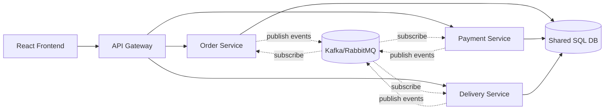
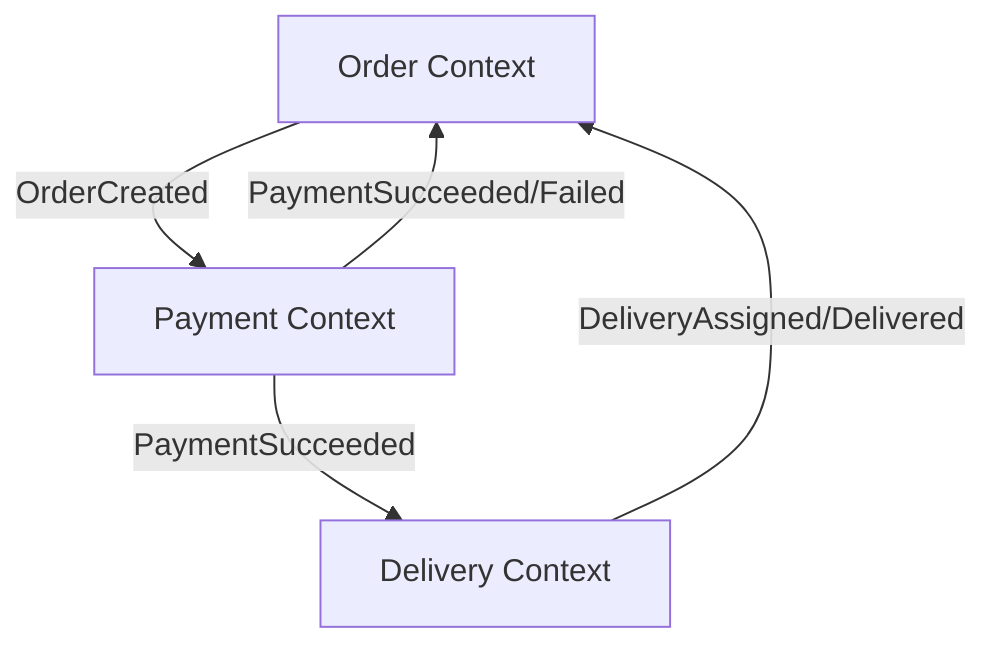
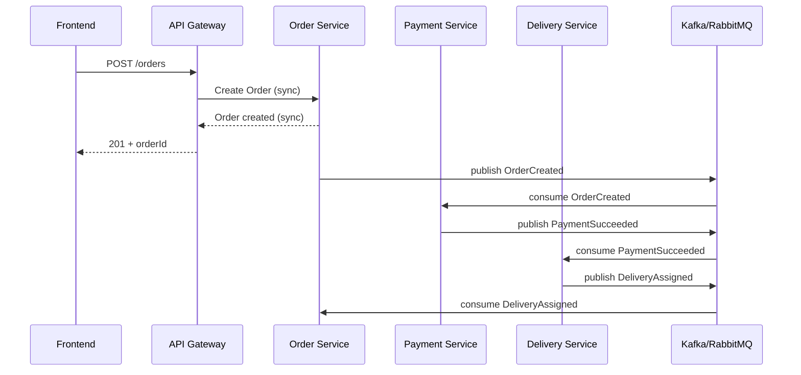

# Bai 03 - Monolith -> Service-based Migration (Online Food Delivery)

Chu de: Distributed architecture style (service-based, SOA)

Pham vi bai tap: 3 functions chinh
- Ordering
- Payment
- Delivery

Rang buoc hien tai:
- Backend giu stack Java (Spring Boot)
- Frontend giu stack React
- 1 database dung chung (phase dau migration)

---

## 1) Monolith hien tai

Trong monolith, tat ca chuc nang nam chung 1 codebase backend:
- API order
- API payment
- API delivery
- Business logic + truy van DB dung chung transaction layer

Uu diem:
- Dev nhanh luc ban dau
- De deploy khi he thong nho

Han che:
- Kho scale rieng theo tai tung chuc nang
- Muc do coupling cao, thay doi 1 module de anh huong module khac
- Build/deploy nguyen khoi ton thoi gian

---

## 2) Service-based migration (van 1 DB)

Muc tieu migration:
- Tach codebase theo service boundaries
- Moi service co API va logic rieng
- Tam thoi van dung 1 DB de giam chi phi migration

Services:
- Order Service
- Payment Service
- Delivery Service
- API Gateway/BFF cho frontend

Luu y:
- Vi van 1 DB, can quy tac ownership table ro rang de tranh coupling nguoc.
- Ve sau co the migration sang database-per-service.

---

## 3) Bounded Context

## 3.1 Order Context

- Doi tuong: Order, OrderItem
- Trach nhiem:
  - Tao don
  - Tinh tong tien
  - Quan ly trang thai don

## 3.2 Payment Context

- Doi tuong: Payment
- Trach nhiem:
  - Xu ly thanh toan
  - Xac nhan thanh cong/that bai
  - Gui su kien cap nhat cho Order/Delivery

## 3.3 Delivery Context

- Doi tuong: Delivery
- Trach nhiem:
  - Tao lenh giao hang
  - Gan tai xe
  - Cap nhat trang thai giao hang

---

## 4) Service Map (Deliverable 1)



---

## 5) Context Map (Deliverable 2)



Context relation:
- Order la upstream cho Payment va Delivery (khoi tao flow).
- Payment la upstream cho Delivery (chi giao khi thanh toan hop le).
- Delivery phan hoi ve Order de dong workflow.

---

## 6) Communication Diagram (Deliverable 3)

### 6.1 Sync vs Async

- Sync (HTTP/gRPC):
  - Frontend -> Gateway -> services (doc du lieu nhanh, request/response ngay)
  - Gateway -> Order Service: create order
- Async (Event messaging):
  - OrderCreated
  - PaymentSucceeded / PaymentFailed
  - DeliveryAssigned / DeliveryDelivered



---

## 7) Event Messaging Design (Kafka/RabbitMQ model)

Topics/Queues de xuat:
- `order.created`
- `payment.succeeded`
- `payment.failed`
- `delivery.assigned`
- `delivery.delivered`

Payload toi thieu:
- `eventId`
- `eventType`
- `occurredAt`
- `traceId`
- `orderId`
- metadata theo context

Best practices:
- Idempotent consumer (tranh xu ly lap)
- Retry + dead-letter queue
- Outbox pattern cho publish event an toan tu DB transaction

---

## 8) Migration Roadmap (Monolith -> Service-based)

1. Tach package trong monolith theo 3 context (Order/Payment/Delivery).
2. Dat contract API ro rang giua cac context.
3. Extract Payment thanh service dau tien.
4. Extract Delivery thanh service thu hai.
5. Dat Gateway/BFF truoc frontend.
6. Bo sung event bus + outbox.
7. Toi uu duong truyen sync/async theo SLA.

---

## 9) Trade-off khi van dung 1 DB

Uu diem:
- Don gian migration ban dau
- Khong can split data gap
- De doi chieu du lieu giai doan dau

Nhuoc diem:
- Service chua thuc su doc lap du lieu
- Co the xuat hien tranh chap schema ownership
- Han che kha nang scale doc lap ve sau

Khuyen nghi:
- Giai doan dau chap nhan shared DB de giam rui ro.
- Giai doan sau can huong den database-per-service cho resilience va autonomy.

---

## 10) Anh chup de nop

1. Service Map (mermaid)
2. Context Map (mermaid)
3. Communication Diagram (sequence)
4. Bounded Context section
5. Sync vs Async section
6. Event messaging design + migration roadmap

---

## 11) Huong dan chay demo code (BE + FE + DB)

Tien quyet:
- Java 21 (hoac Java phu hop voi Spring Boot) + `JAVA_HOME`
- Node.js 20+

### 11.1 Backend Java

```powershell
cd bai03/backend-java
./mvnw.cmd spring-boot:run
```

Test endpoint:

```powershell
curl http://localhost:8080/api/architecture/monolith
curl http://localhost:8080/api/architecture/service-based
```

### 11.2 Frontend React

```powershell
cd bai03/frontend
npm install
npm run dev
```

Mo `http://localhost:5173` de xem dashboard.

### 11.3 Database

Schema mau da co tai file:
- `bai03/db/schema.sql`

Ban co the import vao SQL Server de minh hoa 1 shared DB trong phase migration.

### 11.4 Moc chup hinh goi y

1. Ket qua `curl` 2 endpoint backend.
2. Trang frontend hien JSON monolith va service-based.
3. File `schema.sql` (phan table chinh).
4. 3 so do mermaid trong file nay.
