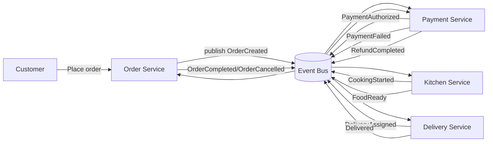
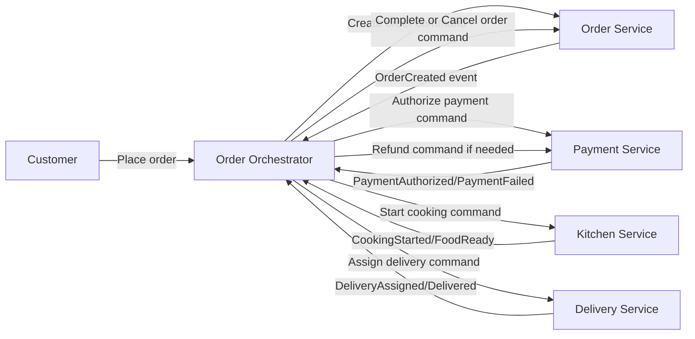

# Bai 04 - Event Choreography vs Orchestration

Chu de: Event-driven Architecture

Bai tap: thiet ke workflow dat don thuc pham voi 5 functions
- Customer
- Order Service
- Payment Service
- Kitchen Service
- Delivery Service

---

## 1) Bai toan nghiep vu

Muc tieu workflow dat don:
1. Khach dat don.
2. He thong tao don va xu ly thanh toan.
3. Bep nhan don va che bien.
4. Don vi giao hang nhan don va giao.
5. Don hoan tat hoac that bai co buoc boi hoan.

Su kien chinh:
- `OrderCreated`
- `PaymentAuthorized`
- `PaymentFailed`
- `CookingStarted`
- `FoodReady`
- `DeliveryAssigned`
- `Delivered`
- `OrderCompleted`
- `OrderCancelled`
- `RefundRequested`
- `RefundCompleted`

---

## 2) Thiet ke Event Choreography

Dac diem:
- Khong co coordinator trung tam.
- Moi service tu nghe event va tu quyet dinh hanh dong tiep theo.

### Event Flow Diagram - Choreography

### Luong thanh cong

1. Order Service phat `OrderCreated`.
2. Payment Service xu ly, phat `PaymentAuthorized`.
3. Kitchen Service nhan `PaymentAuthorized`, phat `CookingStarted` va `FoodReady`.
4. Delivery Service nhan `FoodReady`, phat `DeliveryAssigned`, `Delivered`.
5. Order Service nhan `Delivered`, cap nhat va phat `OrderCompleted`.

### Luong that bai

1. Neu thanh toan that bai: Payment phat `PaymentFailed`.
2. Order Service nhan su kien va phat `OrderCancelled`.
3. Neu that bai sau khi tru tien: Order hoac Delivery phat `RefundRequested`.
4. Payment xu ly boi hoan va phat `RefundCompleted`.

---

## 3) Thiet ke Event Orchestration

Dac diem:
- Co 1 orchestrator trung tam dieu phoi toan bo workflow.
- Cac service thuc thi lenh, tra ket qua cho orchestrator.

### Event Flow Diagram - Orchestration

### Luong thanh cong

1. Orchestrator tao don qua Order Service.
2. Orchestrator goi Payment Service authorize.
3. Neu thanh cong, orchestrator goi Kitchen Service bat dau che bien.
4. Sau `FoodReady`, orchestrator goi Delivery Service.
5. Sau `Delivered`, orchestrator goi Order Service hoan tat don.

### Luong that bai

1. Neu `PaymentFailed`, orchestrator goi huy don.
2. Neu fail o buoc bep/giao, orchestrator kich hoat compensation.
3. Compensation co the gom huy don + refund.

---

## 4) So sanh uu/nhuoc diem

## Choreography

Uu diem:
- Loose coupling cao, service doc lap tot.
- De scale theo tung service vi khong co coordinator thanh bottleneck.
- Phu hop event-native va team autonomous.

Nhuoc diem:
- Kho theo doi end-to-end flow (distributed logic).
- Debug/tracing phuc tap hon.
- De xuat hien cyclic dependency event neu design khong chat.

## Orchestration

Uu diem:
- Luong nghiep vu tap trung, de quan sat va quan tri.
- De ap dung Saga/co compensation phuc tap.
- Phu hop workflow co nhieu rule va branch.

Nhuoc diem:
- Orchestrator co nguy co tro thanh bottleneck.
- Tang coupling huong ve orchestrator.
- Neu orchestrator loi, toan luong co the bi anh huong (can HA).

---

## 5) Danh gia theo scaling + resilience

## Scaling

- Choreography:
  - Scale ngang rat tot theo event consumers.
  - Tranh diem nghen trung tam.
- Orchestration:
  - Scale duoc, nhung phai scale orchestrator chu dong.
  - Can co partitioning theo `orderId` de tranh tranh chap.

## Resilience

- Choreography:
  - Loi 1 service khong lam sap toan he thong.
  - Can retry, DLQ, idempotency rat ky.
- Orchestration:
  - De kien soat retry/timeout/compensation tap trung.
  - Can cluster orchestrator + persistent state de tranh SPOF.

---

## 6) Quyet dinh mo hinh phu hop

Khuyen nghi cho he thong dat do an can scaling + resilience:

1. Neu uu tien scale cao, team da quen event-driven, va luong nghiep vu khong qua phuc tap:
- Chon `Event Choreography`.

2. Neu uu tien kiem soat nghiep vu chat, co nhieu compensation branch, can de quan sat:
- Chon `Event Orchestration`.

3. Khuyen nghi thuc te cho Online Food Delivery:
- Dung mo hinh `Hybrid`:
- Orchestration cho cac workflow thanh toan/boi hoan quan trong.
- Choreography cho cac su kien mo rong (notification, analytics, loyalty, recommendation).

Ket luan de nop:
- Neu chi duoc chon 1 mo hinh cho giai doan dau va can can bang scaling + resilience:
- Chon `Orchestration` voi orchestrator HA + outbox + retry + DLQ.
- Ly do: de quan tri nghiep vu dat don-thanh toan-giao hang co nhieu compensation, giam rui ro van hanh.

---

## 7) Trade-off Notes (Deliverable)

- Choreography manh o autonomy va scale ngang.
- Orchestration manh o governance, observability, va compensation.
- Ca hai deu can:
  - Idempotency key
  - Correlation/trace ID
  - Retry policy
  - Dead Letter Queue
  - Monitoring va distributed tracing

---

## 8) Anh chup de nop

1. Event flow diagram - Choreography.
2. Event flow diagram - Orchestration.
3. Phan so sanh uu/nhuoc.
4. Phan quyet dinh mo hinh cho scaling + resilience.
5. Trade-off notes.
